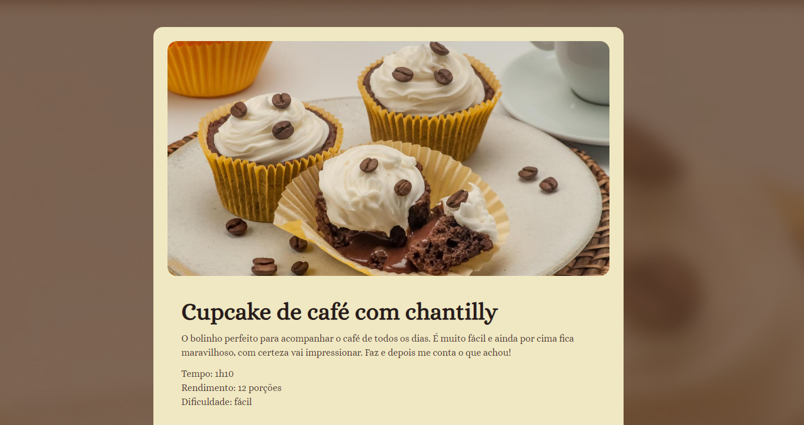

 
  
  

  ## 💻 Projeto
  Esse é um projeto WEB de uma receita de cupcake. Feito para o apredizado dos fundamentos de HTML E CSS.

  ## 🚀 Tecnologias 
  Esse projeto foi desenvolvido com as seguintes tecnologias:

  - HTML
  - CSS
  - Git e Github

  ## 🏷️ Layout
  Você pode visualizar o layout do projeto através [desse link](https://www.figma.com/community/file/1360315130061454535).
  É necessário ter uma conta no [Figma](https://www.figma.com).